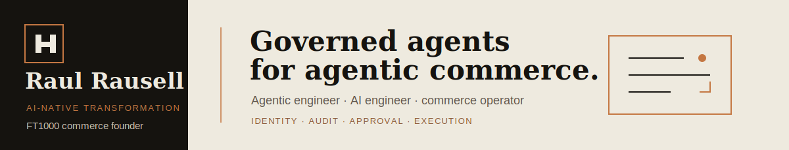

<p align="center">
  
</p>

**AI-native transformation leader building governed agentic-commerce systems.**

I combine **agentic engineering**, **AI engineering**, and **10 years operating a FT1000-recognised e-commerce company**. My work focuses on the operating layer commerce teams now need: catalogues, inventory, orders, approvals, audit trails, agent identity, and human-owned execution.

<p align="center">
  <a href="https://harnexa.ai"><strong>HARNEXA AI</strong></a>
  &nbsp;·&nbsp;
  <a href="https://www.linkedin.com/in/raul-rausell-197843340">LinkedIn</a>
  &nbsp;·&nbsp;
  Barcelona
</p>

## Selected Systems

| System | What it proves |
|---|---|
| **[ai-native-capabilities](https://github.com/rrodenas3/ai-native-capabilities)** | Five spec-first agentic capability patterns: decision intelligence, SASE, commerce, supply chain, compliance |
| **[dark-factory-os](https://github.com/rrodenas3/dark-factory-os)** | Governed agentic operations platform for AI-native enterprise workflows |
| **[workforce-autonomy-control-plane](https://github.com/rrodenas3/workforce-autonomy-control-plane)** | Agent identity, policy, audit, and approval control plane for regulated operations |
| **[virtual_sales_assistant](https://github.com/rrodenas3/virtual_sales_assistant)** | Commerce VSA workbench and precursor to the PHANTOM governed field-sales agent |

## Current Direction

**HARNEXA / PHANTOM VSA**<br>
Governed agentic-commerce deployment for European e-commerce, retail, and CPG operators.

```text
catalog / account data -> agent reasoning -> audit event -> CLEAR check -> human approval
```

PHANTOM turns account context, SKU velocity, stock signals, and promo compliance into suggested commercial action, then stops at the approval boundary before financial execution.

## Build Signature

| Principle | Production meaning |
|---|---|
| Harness before autonomy | Agents call tools only through governed execution |
| Agent identity | Every non-human actor has scope, permissions, and revocation |
| Audit completeness | Every run can be reconstructed |
| Human boundary | Financial/destructive actions require explicit ownership |

## Technical Surface

Python · FastAPI · LangGraph · MCP · OPA · Temporal · PostgreSQL · pgvector · Docker · GitHub Actions · React · Next.js · Vercel · Azure AI Foundry · AWS Bedrock AgentCore

<p align="center">
  <strong>The agents that survive production will be the ones governed from the first run.</strong>
</p>
