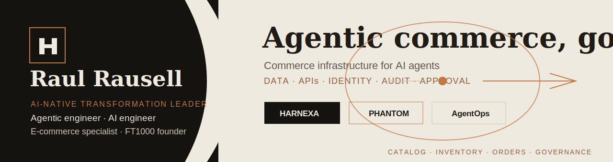

<p align="center">
  
</p>

I build **governed agentic systems**: agents with identity, audit trails, approval gates, evaluation loops, and clear human control.

My edge is the combination of **commerce operator + agentic systems engineer**. I spent a decade building and running a FT1000-recognised digital commerce venture; now I apply that operator experience to production-grade multi-agent systems for commerce and enterprise workflows.

<p align="center">
  <a href="https://harnexa.ai">HARNEXA AI</a> ·
  <a href="https://www.linkedin.com/in/raul-rausell-197843340">LinkedIn</a> ·
  Barcelona
</p>

## Main Contributions

| Project | Contribution |
|---|---|
| [dark-factory-os](https://github.com/rrodenas3/dark-factory-os) | Governed agentic operations platform for AI-native enterprise workflows |
| [ai-native-capabilities](https://github.com/rrodenas3/ai-native-capabilities) | Five spec-first agentic capability patterns: decision intelligence, agentic engineering, commerce agents, supply chain, compliance intelligence |
| [virtual_sales_assistant](https://github.com/rrodenas3/virtual_sales_assistant) | Commerce virtual-sales-assistant workbench and predecessor to the PHANTOM VSA direction |
| [workforce-autonomy-control-plane](https://github.com/rrodenas3/workforce-autonomy-control-plane) | AI control infrastructure for regulated workforce operations |

## Current Build Direction

**HARNEXA AI** is my current flagship: governed agentic deployment for European commerce operators.

The core proof is **PHANTOM VSA**: a governed CPG/retail field-sales agent pattern that turns account context, SKU velocity, stock signals, and promo compliance into a suggested action, then stops at a human approval boundary before anything financial happens.

```text
agent identity -> permission check -> tool call -> audit event
               -> CLEAR evaluation -> approval gate -> revocation path
```

## Systems I Care About

| Theme | Why it matters |
|---|---|
| **Harness-first agents** | Autonomy without control is not production software |
| **Agent identity** | Every non-human actor needs scope, permissions, and revocation |
| **Audit completeness** | If a run cannot be reconstructed, it cannot be trusted |
| **Human approval gates** | Financial and destructive actions need explicit ownership |
| **Commerce operations** | The useful agent is the one that understands the workflow, not just the model |

## Background Signals

- Founder/operator of a **Financial Times FT1000** digital commerce venture.
- MSc Applied Artificial Intelligence, University of Huddersfield.
- MBA, University of Liverpool.
- Research focus: governance-aware multi-agent orchestration and audit completeness.
- Certifications: Microsoft Agentic AI Business Solutions Architect, Azure AI Engineer, AWS AI Practitioner, Oracle GenAI Professional.

## Stack

Python · FastAPI · LangGraph · OpenAI Agents SDK · Claude Agent SDK · MCP · OPA · Temporal · PostgreSQL · pgvector · Docker · GitHub Actions · React · Next.js · Vercel · Azure AI Foundry · AWS Bedrock AgentCore

---

<p align="center">
  <strong>Thesis:</strong> the agents that survive production will be the ones governed from the first run.
</p>
